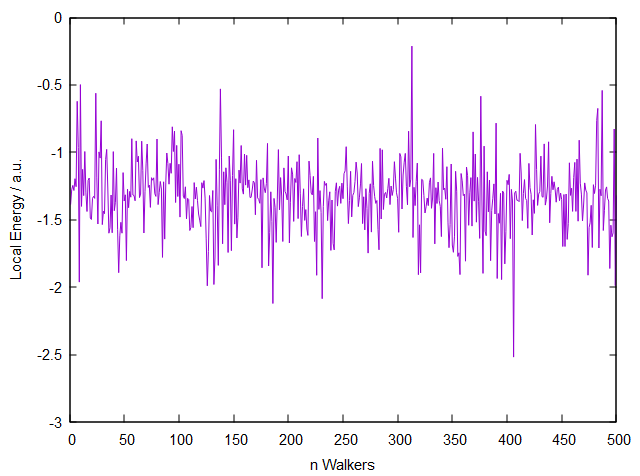

# LTTC-QMC Project
> [Winter School LTTC](https://www.lcpq.ups-tlse.fr/lttc/) 2024.

LTTC-QMC is a simple Quantum Monte Carlo program to compute energies over atomic and molecular hydrogen based systems using Variational Monte Carlo and Pure Diffusion Monte Carlo algorithms.
The code uses nodeless functions to compute energies for simple systems having at least two electrons, such as Hydrogen and Helium atoms or Hydrogen based molecules (H<sub>2</sub><sup>+</sup>, H<sub>2</sub>, H<sub>3</sub><sup>+</sup>).

For more details consult the ```Documentation``` file.

## Installing
To let the program work you only need a Fortran compiler (such as *gfortran*) to compile the code.
Then, you can clone the repository: ```https://github.com/TeoWalder/LTTC-QMC.git``` 
or download and extract the `.zip` file from the GitHub page.

## Getting Started
After the installation you can compile the code by just typing:
```
make all
```
and generate the executable file ```qmc.x```.
Before running the executable you need to first check two different input files:

- The **input file** ```qmc.inp```, containing all the parameters of the simulation
- The **geometry file** ```[name].xyz```, containing the coordinates of the system to simulate

After the executable runs succesfully, the output is printed on the terminal giving you the **energy** and the **acceptance ratio** each with the corresponding errorbar in the following form:

```
E =    -1.324283046   +/-    0.117287E-01
A =     0.976170400   +/-    0.102687E-03
```
You can also find an ```e_loc.dat``` file you can plot to look at the local energies per walker.



### Input files
From ```qmc.inp``` you can choose the type of simulation, such *Variational* or *Pure Diffusion* Monte Carlo, tune its parameters and define all the variables.
The geometry file is a ```.xyz``` specifying the nuclear coordinates and its name must be specified inside the iput file. You can already find a set of prepared files in the directory ```Geometries/``` for all the tested systems.

Both the files must be in the same directory as the executable.

## Tests

## Licensing
The code in this project is licensed under GPL license. More on ```LICENSE``` file.
